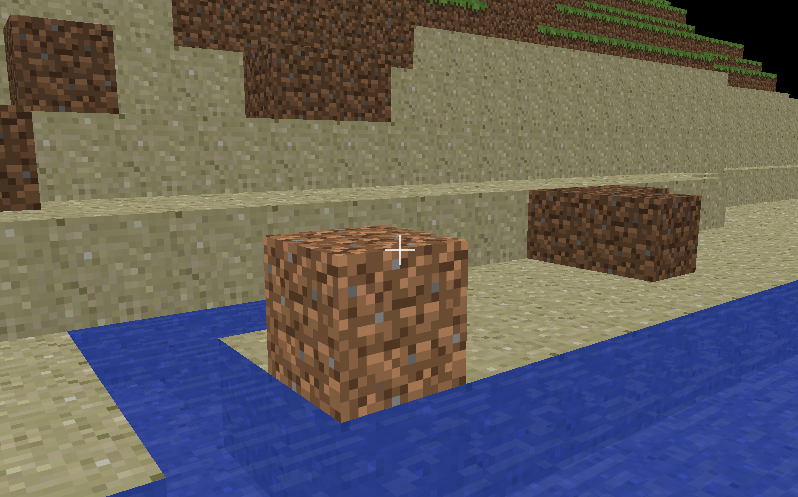

MineCraft Mini
==============


Features
---------
- MineCraft Lite in Java and OpenGL
- Physics simulation, water simulation
- Perlin noise algorithm to generate maps
- Directional flood-fill to optimize rendering
- Randomized caves, lakes

Installation
-----------
Build on Mac OS X. Scripts can be adapted for Windows. LWJGL libraries not included for linux.

Run ```./build.sh``` to build

Use ```./run.sh``` to run


Gameplay
-----------

WASD - to move

F - for fullscreen

Space - to jump higher nigga


License
--------

Copyright 2014 Yu Xuan Liu. All rights reserved. Content licensed under the [GNU General Public License v3.0](LICENSE)
